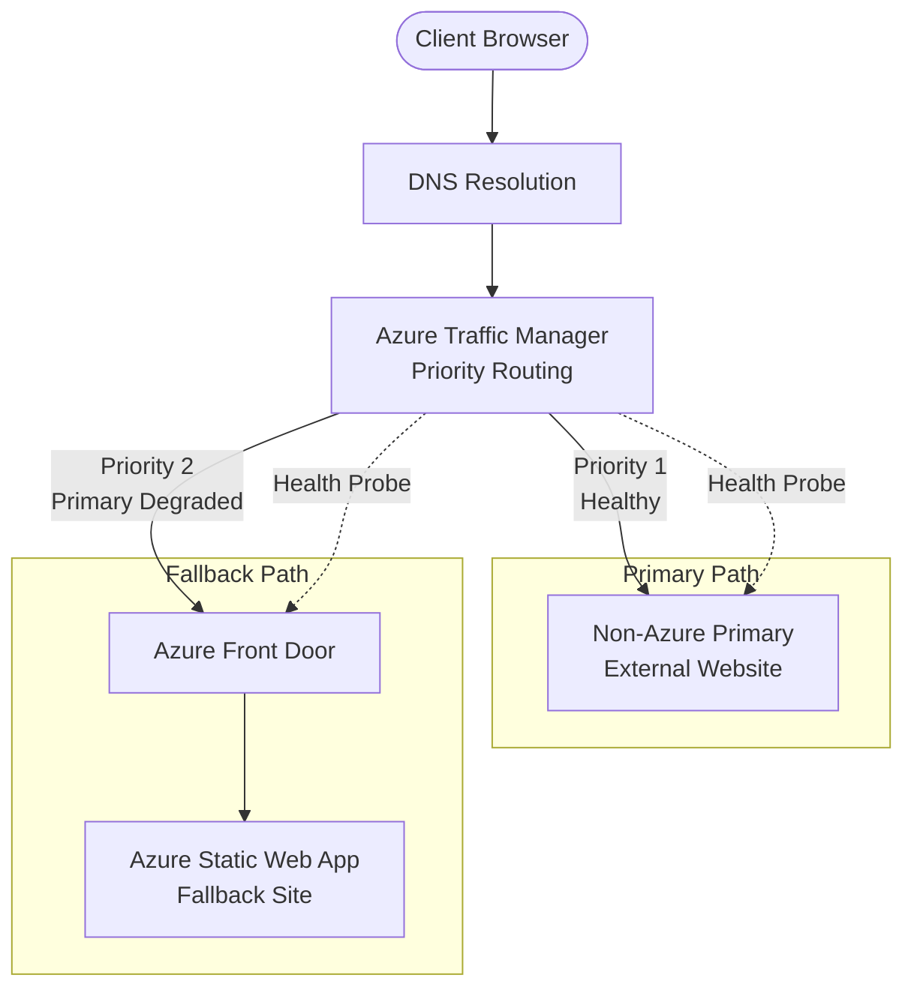

# Architecture: Resiliency POC — Option #1

**Author:** Holden (Lead / Azure Architect)  
**Date:** 2026-04-27  
**Status:** Proposal — pending user decisions

---

## 1. Summary

This POC implements **Option #1** from the Azure Architecture Blog "Resiliency patterns for Azure Front Door — Field Lessons": a DNS-based failover pattern using **Azure Traffic Manager** as the failover brain, with **Azure Front Door** serving the fallback path to an **Azure Static Web App**. The primary origin is a non-Azure website (simulating a customer's existing external infrastructure). When Traffic Manager's health probes determine the primary is down, DNS resolution shifts traffic to the AFD-fronted SWA fallback. This pattern is ideal for scenarios where the primary site lives outside Azure and the customer wants Azure-hosted disaster recovery without re-architecting their primary stack. Traffic Manager's global DNS-based routing provides the cross-platform failover capability that AFD alone cannot deliver (AFD can only fail over between its own configured origins).

---

## 2. Topology

### 2.1 Traffic Flow Diagram

```
                                ┌─────────────────────────────────────────────┐
                                │              Azure Traffic Manager          │
                                │         (Priority Routing, Always Serve)    │
                                │                                             │
                                │   Priority 1          Priority 2            │
                                │   ┌─────────┐        ┌─────────┐           │
                                │   │ Primary │        │Fallback │           │
                                │   │Endpoint │        │Endpoint │           │
                                └───┴────┬────┴────────┴────┬────┴───────────┘
                                         │                  │
           ┌─────────────────────────────┘                  └──────────────────────────┐
           │                                                                           │
           ▼                                                                           ▼
┌─────────────────────────┐                                          ┌──────────────────────────────┐
│   NON-AZURE PRIMARY     │                                          │     Azure Front Door         │
│   (External Website)    │                                          │     (Standard or Premium)    │
│                         │                                          │                              │
│  • Customer's existing  │                                          │  Origin: Azure Static        │
│    infrastructure       │                                          │          Web App             │
│  • Could be AWS, GCP,   │                                          │                              │
│    on-prem, other CDN   │                                          │  WAF: Optional for POC       │
└─────────────────────────┘                                          └──────────────┬───────────────┘
                                                                                    │
                                                                                    ▼
                                                                     ┌──────────────────────────────┐
                                                                     │   Azure Static Web App       │
                                                                     │   (Fallback Site)            │
                                                                     │                              │
                                                                     │  • "Site under maintenance"  │
                                                                     │    or mirrored content       │
                                                                     └──────────────────────────────┘
```

### 2.2 Mermaid Diagram



### 2.3 Where the Failover Decision Happens

**Critical point:** The failover decision happens **at the DNS layer in Traffic Manager**, not in AFD.

1. Client requests `app.example.com`
2. DNS resolves to Traffic Manager profile FQDN (`app-tm.trafficmanager.net`)
3. Traffic Manager evaluates health of Priority 1 endpoint (primary external site)
4. If healthy → returns IP/CNAME of primary external site
5. If degraded/unhealthy → returns CNAME of AFD endpoint (Priority 2)
6. Client connects directly to whichever endpoint TM returned

AFD is **not** making the failover decision — it only serves the fallback path. This is the defining characteristic of Option #1.

### 2.4 Azure Resources Required

| Resource | Purpose | SKU/Tier |
|----------|---------|----------|
| Azure Traffic Manager Profile | DNS-based failover brain | (Single tier) |
| Traffic Manager Endpoint #1 | Points to non-Azure primary | External Endpoint |
| Traffic Manager Endpoint #2 | Points to AFD | Azure Endpoint or External |
| Azure Front Door Profile | Serves fallback traffic, optional WAF | Standard or Premium |
| AFD Endpoint | Public hostname for fallback | — |
| AFD Origin Group | Contains SWA origin | — |
| AFD Origin | Points to SWA | — |
| AFD Route | Routes /* to SWA origin | — |
| Azure Static Web App | Hosts fallback content | Free tier (sufficient for POC) |
| Resource Group | Contains all Azure resources | — |

**External Resource:**
| Resource | Purpose |
|----------|---------|
| Non-Azure Primary Website | The "production" site we're protecting; external to Azure |

---

## 3. Failover Semantics

### 3.1 What Does "Primary is Down" Mean?

Traffic Manager determines "primary is down" when:
- **Consecutive probe failures** exceed the configured threshold
- Probe failures = HTTP response code outside expected range OR timeout OR connection failure

For this POC, "down" means:
- Primary returns HTTP 5xx, 4xx, or fails to respond within timeout
- Primary's health endpoint (`/health` or `/`) is unreachable

### 3.2 Traffic Manager Configuration

| Setting | Value | Rationale |
|---------|-------|-----------|
| **Routing Method** | Priority | Ensures traffic goes to primary when healthy |
| **Endpoint 1 Priority** | 1 | Primary (non-Azure external site) |
| **Endpoint 2 Priority** | 2 | Fallback (AFD → SWA) |
| **Always Serve Mode** | Enabled | TM continues serving even if all endpoints degrade |

### 3.3 Health Probe Configuration

| Setting | Recommended Value | Notes |
|---------|-------------------|-------|
| **Protocol** | HTTPS | Validates full TLS handshake; more realistic |
| **Port** | 443 | Standard HTTPS |
| **Path** | `/health` or `/` | Dedicated health endpoint preferred |
| **Interval** | 30 seconds | Balance between detection speed and probe load |
| **Timeout** | 10 seconds | Probe must complete within this window |
| **Tolerated Failures** | 3 | Consecutive failures before marking unhealthy |
| **Expected Status Codes** | 200 | Only 200 = healthy; 3xx/4xx/5xx = degraded |

**SNI Consideration:** Traffic Manager probes include SNI with the endpoint hostname. If the primary uses a different certificate CN, configure the probe with explicit hostname header.

### 3.4 RTO Calculation (Recovery Time Objective)

**Time to detect failure:**
```
Detection Time = (Tolerated Failures × Interval) + Timeout
               = (3 × 30s) + 10s
               = 100 seconds worst case
```

**Time for DNS to propagate:**
```
DNS Propagation = TM Profile TTL + downstream resolver caching
                = 60s (recommended TTL) + 0-60s (resolver variance)
                = 60–120 seconds
```

**Total RTO:**
```
RTO = Detection Time + DNS Propagation
    = 100s + 60-120s
    = ~160–220 seconds (2.5–4 minutes)
```

To reduce RTO:
- Lower probe interval to 10s (increases probe traffic)
- Reduce tolerated failures to 2 (risk of false positives)
- Lower DNS TTL to 30s (increases DNS query volume)

Aggressive config: `(2 × 10s) + 10s + 30s = ~50–80 seconds`

### 3.5 Failback Behavior

**Automatic failback:** When primary recovers and passes health probes, Traffic Manager automatically routes new DNS queries back to primary. No manual intervention required.

**Considerations:**
- Existing connections to fallback remain until client DNS cache expires
- No "sticky" behavior — purely DNS-based
- Recommend testing failback explicitly (primary recovery scenario)

### 3.6 DNS TTL Recommendation

| TTL Value | Trade-off |
|-----------|-----------|
| 30 seconds | Faster failover, higher DNS query volume, more cost |
| 60 seconds | **Recommended for POC** — good balance |
| 300 seconds | Slower failover, lower DNS cost, not recommended for resiliency |

**Recommendation:** 60 seconds for POC. Production workloads with aggressive RTO targets may use 30s.

---

## 4. Decisions Needed from User

### 4.1 Custom Domain

**Question:** Use Jim's custom domain, or rely on Azure-generated hostnames?

**Recommendation:** **Skip custom domain for POC.**

Reasoning:
- Custom domain requires DNS delegation, certificate provisioning (managed or BYOC), and TM CNAME wiring
- Adds 2–3 work items and potential debugging time (cert validation, propagation delays)
- Azure-generated hostnames (`*.trafficmanager.net`, `*.azurefd.net`, `*.azurestaticapps.net`) are sufficient to demonstrate the failover pattern
- If Jim wants to see real cert behavior, we can add custom domain as a "Phase 4" enhancement

**If user overrides:** We'll need the domain name, DNS provider access, and decision on managed vs BYOC certificates.

### 4.2 AFD SKU

**Question:** Azure Front Door Standard or Premium?

**Recommendation:** **Standard SKU.**

Reasoning:
- Standard includes: global load balancing, SSL termination, caching, basic WAF (via WAF policy)
- Premium adds: Private Link origins, advanced WAF (bot protection, managed rule sets), enhanced analytics
- For a POC with SWA as origin (public endpoint), Premium features aren't needed
- Cost difference: Standard ~$35/mo base; Premium ~$330/mo base
- Standard is sufficient to demonstrate the failover pattern

### 4.3 Region(s)

**Question:** Which Azure region(s) for AFD and SWA?

**Recommendation:** 
- **AFD:** Global resource (no region selection needed)
- **SWA:** `eastus2` or `westus2` (US-based, good availability, common choice)

Single region is fine for POC. SWA is globally distributed at the edge anyway.

### 4.4 Non-Azure Primary Stand-In

**Question:** What serves as the "non-Azure primary" during the POC?

**Options:**
| Option | Cost | Realism | Complexity |
|--------|------|---------|------------|
| Public website (e.g., `example.com`, `httpbin.org`) | Free | Low | None |
| GitHub Pages site | Free | Medium | Low |
| Cloudflare Pages / Netlify / Vercel | Free | High | Low |
| Azure VM pretending to be external | ~$15/mo | Medium | Medium |
| Actual on-prem/non-Azure server | Varies | Highest | High |

**Recommendation:** **GitHub Pages or Cloudflare Pages (free tier).**

Reasoning:
- Free, publicly accessible, we control the content
- Can deploy a simple HTML page with `/health` endpoint (or just `/`)
- Simulates "customer's existing site outside Azure"
- Easy to "break" for failover testing (delete the repo, change DNS, return 503)
- No Azure cost, no infrastructure to manage

**Alternative if user prefers Azure-based:** Deploy an Azure Container Instance with Nginx, but don't put it behind AFD — treat it as "external." This costs ~$1–2/day but adds complexity.

### 4.5 Additional Questions

1. **Naming convention:** Any preferred prefix for Azure resources? (e.g., `publix-poc-*`)
2. **Subscription/Resource Group:** Create new RG or use existing?
3. **GitHub repo:** Is this repo (`publix`) where Bicep and site code will live?
4. **Testing approach:** Manual failover testing sufficient, or want scripted chaos?

---

## 5. Build Plan

Assuming decisions above are resolved, here's the phased work plan:

### Phase 1: Scaffolding & Primary Stand-In

| Phase | # | Work Item | Owner | Depends On | Deliverable |
|-------|---|-----------|-------|------------|-------------|
| 1 | 1 | Finalize architecture decisions | Holden | User input | Updated `architecture.md` with locked decisions |
| 1 | 2 | Set up non-Azure primary (GitHub Pages or Cloudflare) | Alex | — | Live external site with `/health` returning 200 |
| 1 | 3 | Create Bicep module structure (`infra/` folder, `main.bicep`, parameter files) | Naomi | #1 | Empty Bicep scaffold, deploys empty RG |

### Phase 2: Azure Infrastructure

| Phase | # | Work Item | Owner | Depends On | Deliverable |
|-------|---|-----------|-------|------------|-------------|
| 2 | 4 | Bicep: Azure Static Web App | Naomi | #3 | SWA resource deployed, default placeholder |
| 2 | 5 | Build fallback site HTML/CSS | Alex | — | Static site in `src/fallback/` |
| 2 | 6 | GitHub Actions: Deploy fallback site to SWA | Alex | #4, #5 | Working CI/CD pipeline |
| 2 | 7 | Bicep: Azure Front Door (Standard) + origin pointing to SWA | Naomi | #4 | AFD profile, endpoint, origin, route |
| 2 | 8 | Bicep: Traffic Manager profile + endpoints (external + AFD) | Naomi | #2, #7 | TM with priority routing configured |
| 2 | 9 | Verify end-to-end traffic flow (primary healthy) | Amos | #8 | Manual test: TM → Primary works |

### Phase 3: Failover Validation

| Phase | # | Work Item | Owner | Depends On | Deliverable |
|-------|---|-----------|-------|------------|-------------|
| 3 | 10 | Document failover test procedure | Holden | #8 | Runbook in `docs/failover-test.md` |
| 3 | 11 | Execute failover test (break primary, verify fallback) | Amos | #9, #10 | Test report with timestamps, RTO measurement |
| 3 | 12 | Execute failback test (restore primary, verify return) | Amos | #11 | Test report confirming automatic failback |
| 3 | 13 | Final architecture review and documentation cleanup | Holden | #12 | Updated docs, lessons learned |

### Optional Phase 4: Enhancements (if time permits)

| Phase | # | Work Item | Owner | Depends On | Deliverable |
|-------|---|-----------|-------|------------|-------------|
| 4 | 14 | Add custom domain + managed certificate | Naomi | #8, user provides domain | End-to-end with real domain |
| 4 | 15 | Add WAF policy to AFD | Naomi | #7 | Basic WAF rules on fallback path |

---

## 6. Open Risks

| # | Risk | Impact | Mitigation |
|---|------|--------|------------|
| 1 | **DNS TTL caching by ISPs/resolvers** | Failover takes longer than calculated RTO if downstream resolvers ignore TTL | Test from multiple networks; document that RTO is best-effort |
| 2 | **Traffic Manager probe SNI/Host header mismatch** | Probes fail even when site is healthy if TLS cert doesn't match probe hostname | Configure explicit hostname in TM endpoint probe settings |
| 3 | **AFD managed certificate provisioning delay** | If using custom domain later, cert provisioning can take 10–30 minutes | Use Azure-generated hostnames for POC; plan buffer time if adding custom domain |
| 4 | **SWA cold start or regional unavailability** | Fallback site itself could be unavailable | SWA has strong SLA and global distribution; accept this risk for POC |
| 5 | **False positive failover** | Aggressive probe settings could cause unnecessary failover if primary has transient issues | Use tolerated failures ≥ 3; tune based on primary's stability characteristics |

---

## Appendix: Reference Material

- [Azure Architecture Blog: Resiliency patterns for Azure Front Door — Field Lessons](https://techcommunity.microsoft.com/blog/azurearchitectureblog/resiliency-patterns-for-azure-front-door-field-lessons/4501252)
- [Azure Architecture Center: Global Routing Redundancy for Mission-Critical Web Applications](https://learn.microsoft.com/en-us/azure/architecture/guide/networking/global-web-applications/overview)
- [Traffic Manager: How it Works](https://learn.microsoft.com/en-us/azure/traffic-manager/traffic-manager-how-it-works)
- [AFD: Origin Security](https://learn.microsoft.com/en-us/azure/frontdoor/origin-security)
